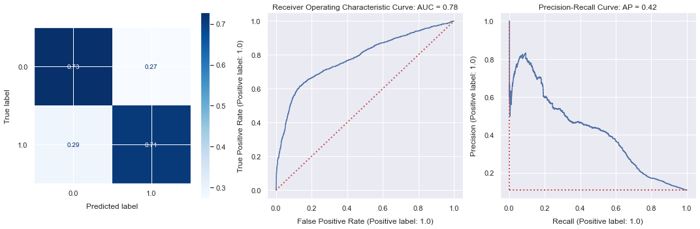
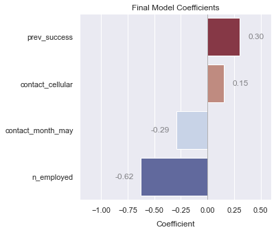

# Predicting Bank Telemarketing Sales

- Nick Gigliotti
- ndgigliotti@gmail.com

# Business Problem

Banco de Portugal has asked me to create a model to help them predict which customers are likely to invest in term deposit accounts as a result of telemarketing. Telemarketing is, no doubt, very stressful and time-consuming work. Salespersons don't like to waste the time of customers, because it's a waste of their time too. Not only that, but dealing with uninterested customers is surely the ugliest part the job. How many times a day does a bank telemarketer have to put up with insults and rude remarks? On the other hand, salespersons who are stuck calling low-potential customers are likely to resort to aggressive, desperate, sales tactics. It's like trench warfare over the phone, and it needs to be made easier.

That's where machine learning comes into play, and in particular **logistic regression**. Logistic regression models are widely used because they offer a good combination of simplicity and predictive power. My goal is to create a strong predictive model which can predict investments based on data which can be realistically obtained in advance. Banco de Portugal will use my model to increase the efficency of their telemarketing efforts by discovering the customers with the highest probability of investing.

# Dataset
I train my predictive classifier on a Banco de Portugal telemarketing dataset which is publically available on the [UCI Machine Learning Repository](https://archive.ics.uci.edu/ml/datasets/Bank+Marketing). The data was collected between May 2008 and November 2010. It contains 21 features total and about 41k observations. About two thirds of the features are categorical and one third are numeric.

## Feature Explanations

Note that I have renamed some of the features from the original dataset to make them easier to interpret.

#### Client Information
   
1. 'age' - years
2. 'job' - type of job
3. 'marital' - marital status
4. 'education' - level of education
5. 'default' - has defaulted on credit
6. 'housing' - has housing loan
7. 'loan' - has personal loan

#### Current Campaign

8. 'contact_type' - call type of **last contact** (cellular or landline)
9. 'contact_month' - month of **last contact**
10. 'contact_weekday' - weekday of **last contact**
11. 'contact_duration' - duration of **last contact** in seconds
12. 'contact_count' - total number of contacts during this campaign
13. 'invested' - invested in a term deposit (target variable)

>A term deposit is a short-term investment which typically matures within a few months or years.

#### Previous Campaigns

14. 'days_since_prev' - number of days since last contacted during previous campaign
15. 'prev_contact_count' - total number of contacts before this campaign
16. 'prev_outcome' - sales result of previous campaign
17. 'prev_failure' - previous campaign failed to result in a sa
18. 'prev_success' - previous campaign resulted in a sale

#### Economic Context

19. 'emp_var_rate' - employment variation rate (quarterly indicator)
20. 'cons_price_idx' - consumer price index (monthly indicator)
21. 'cons_conf_idx' - consumer confidence index (monthly indicator)
22. 'euribor_3m' - euribor 3 month rate (daily indicator)
23. 'n_employed' - thousands of people employed (quarterly indicator)

# Methods

1. I perform some preliminary data cleaning and reorganization, including converting some categorical and numeric features to binary {0, 1} features.
2. I perform a train-test split, dropping 'contact_duration'.
    > The 'contact_duration' feature is not information that Banco de Portugal would realistically be able to plug into my model in advance.
3. I set up preprocessing pipelines which feed into a Scikit-Learn classification "estimator".
4. I create a baseline dummy model and a baseline **logistic regression** model.
5. I make iterative progress on the logistic regression model, adding preprocessors and changing parameters at each step.
    1. I encode categorical variables using a one-hot scheme, letting missing values go to 0.0.
    2. I fill the few remaining missing values with 0.0, for consistency.
    4. I filter out highly inter-correlated sets of features, retaining the best feature from each set. This is crucial to avoid multicollinearity.
    5. I perform a slight 95% Winsorization on the data before scaling to reduce the influence of outliers.
    6. I center the data on each feature's mean and scale to standard deviation.
    7. I use Scikit-Learn's built-in class weight balancing.
    8. I use L2 regularization to weed out less relevant features.
6. I retrain the final model pipeline on the full dataset.

# Final Model
Here is a look at the diagnostic plots (confusion matrix, ROC curve, precision-recall curve) of the final model before it was retrained on the full dataset. Notice the strong diagonal on the confusion matrix, with ~0.71 positive recall. The average precision (AP) score is 0.42 and the weighted ROC AUC score is 0.78. Not bad, after dropping 'contact_duration', the strongest feature in the dataset.

The highest magnitude coefficients are 'prev_success', 'contact_cellular', 'n_employed', and 'contact_month_may'. The most interesting novel discovery gleaned from the model is that the Portuguese employment count has a very strong negative relationship with clients choosing to invest. I don't understand why this is, but it is undoubtedly very strong. When employment is low, bank marketing for term deposits is highly effective!

    

# Future Work
The most important future work would be to build different types of models and compare them to my final `LogisticRegression`. `RandomForestClassifier`, `LinearSVC`, and `KNeighborsClassifier` are three obvious choices. Unlike most support vector machines, the `LinearSVC` is able to handle datasets with large numbers of observations. But as it is a linear model, I still have to worry about multicollinearity.

Multicollinearity is not a concern, however, with the `RandomForestClassifier` or the `KNeighborsClassifier`. That means no features have to be dropped on that account. This alone is reason to think one of these models could perform better than my regression.  Of all of these, I see the most potential in the `RandomForestClassifier`, in part because it has so many hyperparameters to tune.

# Repository Guide
- My custom analysis code can be found in the 'tools' module/directory.
  - The original data files are located in the 'data' directory.
  - The final model pipeline is saved in the 'models' directory.
  - The parameter search results are located in the 'sweep_results' directory.
- See main_notebook.ipynb for the analysis notebook.
- See the 'presentation' directory for the presentation and related files.
- See the 'reference' directory for a paper written on a similar dataset.
